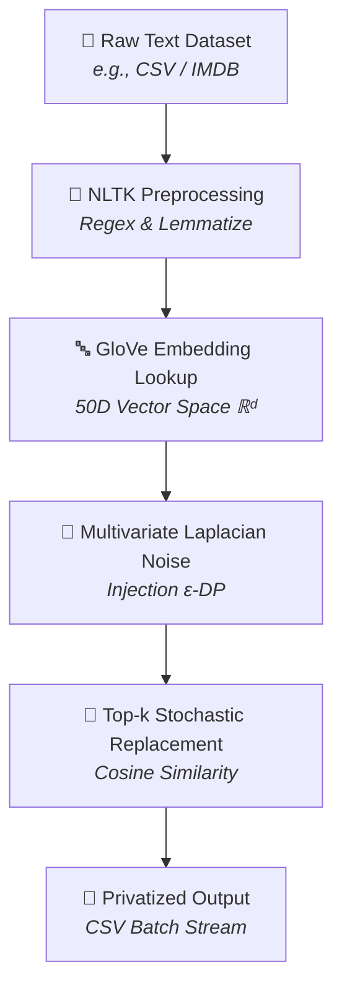

# Differentially Private NLP Text Obfuscation Pipeline


> 🎓 **Academic Project Note:** This repository contains the core research implementation and engineering pipeline developed as part of my **M.Tech Final Thesis / Capstone Project**.

An end-to-end Local Differential Privacy (LDP) text obfuscation framework operating in continuous dense vector space ($\mathbb{R}^d$). This pipeline protects sensitive unstructured text datasets (e.g., IMDB reviews, clinical notes, support chats) from adversarial re-identification and membership inference attacks while preserving high downstream semantic utility for Machine Learning models.

---

## Key Features

* **Continuous Metric LDP:** Injects calibrated Multivariate Laplacian Noise directly into 50-dimensional GloVe embedding space rather than using crude discrete token replacement.
* **Stochastic Top-k Replacement:** Defends against deterministic reverse-spatial lookup attacks by sampling substitutes non-deterministically from nearest top-k candidates ($k=5$).
* **Robust Exception Handling:** Implements `try-except` OOV (Out-Of-Vocabulary) fallbacks to prevent pipeline failures on unseen terms.
* **CUDA-Accelerated Batch Streaming:** Optimized for GPU execution using PyTorch tensor casting and `pandas.iloc` chunked CSV export to maintain low memory overhead on large datasets.

---

## Architecture & Technical Workflow



## Theoretical Foundations

A randomized algorithm $M$ provides **$\varepsilon$-Local Differential Privacy** if, for any two inputs $d, d'$ and output set $S$:

$$\mathbb{P}[M(d) \in S] \le e^{\varepsilon} \cdot \mathbb{P}[M(d') \in S]$$

### Noise Mechanism in $\mathbb{R}^d$ Space

Noise vector $N \in \mathbb{R}^d$ is generated via:

1. **Direction Vector ($u$):** Uniform sampling on a $d$-dimensional unit sphere via standard normal variables: $u = Z / \Vert{}Z\Vert{}_2$, where $Z \sim \mathcal{N}(0, I_d)$.
2. **Magnitude ($r$):** Radial distance sampled from a Gamma distribution parameterized by dimension $d$ and scale parameter $b = \Delta / \varepsilon$: $r \sim \text{Gamma}(\text{shape}=d, \text{scale}=\Delta / \varepsilon)$.
3. **Perturbation:** $v_{\text{noisy}} = v_{\text{original}} + (r \cdot u)$.

---

## Installation & Setup

```bash
# Clone the repository
git clone https://github.com/your-username/differentially-private-nlp-pipeline.git
cd differentially-private-nlp-pipeline

# Create virtual environment
python -m venv venv
source venv/bin/activate  # On Windows: venv\Scripts\activate

# Install dependencies
pip install torch numpy pandas gensim nltk reportlab
```

---

## Core Implementation (`main.py`)

```python
import re
import numpy as np
import pandas as pd
import torch
import nltk
from nltk.corpus import stopwords
from nltk.tokenize import word_tokenize
from nltk.stem import WordNetLemmatizer
from gensim.models import KeyedVectors

# Download NLTK resources
nltk.download('punkt')
nltk.download('stopwords')
nltk.download('wordnet')

stop_words = set(stopwords.words('english'))
lemmatizer = WordNetLemmatizer()

# Check CUDA Availability
device = torch.device('cuda' if torch.cuda.is_available() else 'cpu')


def clean_text(text: str) -> list:
    """Cleans, tokenizes, removes stopwords, and lemmatizes input text."""
    text = re.sub(r'[^a-zA-Z]', ' ', str(text)).lower()
    tokens = word_tokenize(text)
    return [
        lemmatizer.lemmatize(w) for w in tokens 
        if w not in stop_words and len(w) > 1
    ]


def generate_laplacian_noise_vector(dim: int = 50, sensitivity: float = 1.0, epsilon: float = 25.0) -> np.ndarray:
    """Generates a d-dimensional continuous Multivariate Laplacian Noise vector."""
    gaussian_samples = np.random.normal(0, 1, dim)
    norm = np.linalg.norm(gaussian_samples)
    direction = gaussian_samples / norm if norm != 0 else gaussian_samples
    
    scale = sensitivity / epsilon
    magnitude = np.random.gamma(shape=dim, scale=scale)
    
    return direction * magnitude


def replace_word(word: str, model: KeyedVectors, epsilon: float = 25.0, sensitivity: float = 1.0, top_k: int = 5) -> str:
    """Applies LDP vector perturbation and retrieves top-k stochastic nearest neighbor."""
    if word not in model:
        return word  # OOV Fallback
    
    original_vec = model[word]
    noise = generate_laplacian_noise_vector(dim=model.vector_size, sensitivity=sensitivity, epsilon=epsilon)
    noisy_vec = original_vec + noise
    
    try:
        similar_words = model.most_similar(positive=[noisy_vec], topn=top_k)
        candidates = [candidate for candidate, sim in similar_words]
        return np.random.choice(candidates)
    except Exception:
        return word  # Exception Fallback


def obfuscate_tokens(tokens: list, model: KeyedVectors, epsilon: float = 25.0) -> str:
    """Processes list of tokens through the LDP obfuscation pipeline."""
    obfuscated = [replace_word(token, model, epsilon=epsilon) for token in tokens]
    return " ".join(obfuscated)


def process_pipeline_batched(df: pd.DataFrame, text_col: str, model: KeyedVectors, 
                             batch_size: int = 100, output_csv: str = "privatized_output.csv"):
    """CUDA-aware batched pipeline processor streaming output to CSV."""
    total_rows = len(df)
    first_batch = True
    
    # Cast embeddings to GPU if available
    embedding_matrix = torch.tensor(model.vectors, dtype=torch.float32).to(device)
    
    for start_idx in range(0, total_rows, batch_size):
        end_idx = min(start_idx + batch_size, total_rows)
        batch_df = df.iloc[start_idx:end_idx].copy()
        
        batch_df['clean_tokens'] = batch_df[text_col].apply(clean_text)
        batch_df['obfuscated_text'] = batch_df['clean_tokens'].apply(
            lambda tokens: obfuscate_tokens(tokens, model)
        )
        
        export_df = batch_df.drop(columns=['clean_tokens'])
        
        if first_batch:
            export_df.to_csv(output_csv, mode='w', index=False, header=True)
            first_batch = False
        else:
            export_df.to_csv(output_csv, mode='a', index=False, header=False)
            
    print(f"Dataset successfully privatized and saved to {output_csv}")
```

---

## 🎓 Academic Background & Research Scope

Developed and evaluated as part of my M.Tech Degree (Master of Technology) Thesis Project. 
The research explores bridging theoretical Local Differential Privacy mechanisms in continuous metric spaces ($\mathbb{R}^d$) with 
scalable GPU-accelerated Machine Learning infrastructure.
